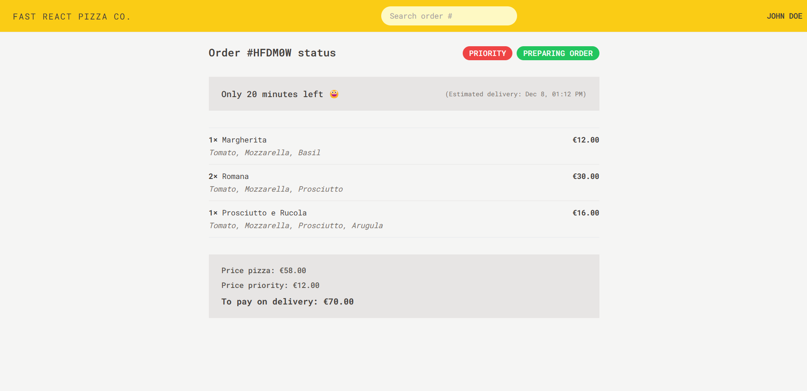

# Fast-React-Pizza-Co



Fast React Pizza Co. is a Redux project where users can order pizza without the need for authentication.

You can view the project live here:
[Fast-React-Pizza](https://reactpizza-abdousadik.netlify.app/)

## Table of Contents
- [Project Requirements from the Business](#project-requirements-from-the-business)
- [Technologies](#technologies)
- [Getting Started](#getting-started)
- [References](#references)

## Project Requirements from the Business

This application allows users to:

- Browse and order one or more pizzas from a menu.
- Use the app without creating an account or logging in.
  - Users simply input their name before ordering.
- View a dynamic pizza menu that is fetched from an API.
- Add multiple pizzas to a cart before placing an order.
- Provide their name, phone number, and address when ordering.
  - Optionally, users can provide their GPS location to simplify delivery.
- Mark their order as “priority” for an additional 20% of the cart price.
- Place orders via a POST request containing their user data and selected pizzas.
  - Payment is made upon delivery, so no in-app payment processing is required.
- Receive a unique order ID to track their order later.
- Mark their order as “priority” even after it has been placed.

## Technologies

The project is built with:

- **React**
- **Tailwind CSS**
- **React Router**
- **Redux**

## Getting Started

To run the project locally:

1. Clone the repository:
   ```bash
   git clone https://github.com/abdousadik/fast-react-pizza.git
   ```
2. Navigate to the project directory:
   ```bash
   cd fast-react-pizza
   ```
3. Install dependencies:
   ```bash
   npm install
   ```
4. Start the development server:
   ```bash
   npm run dev
   ```

---

Back to [Top](#fast-react-pizza-co)
